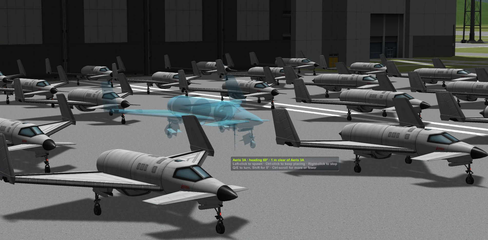
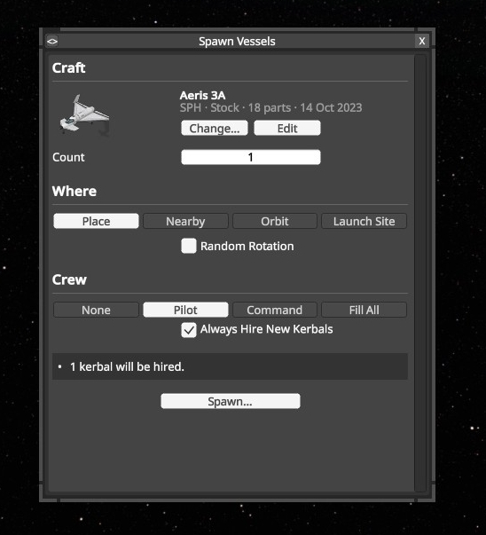
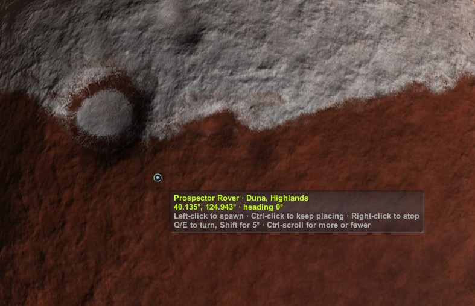
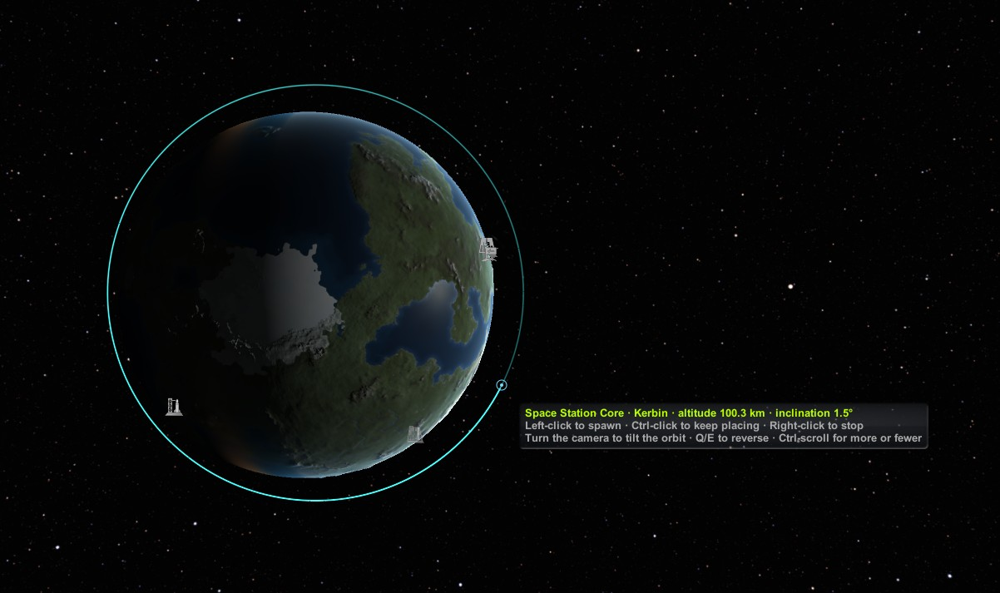
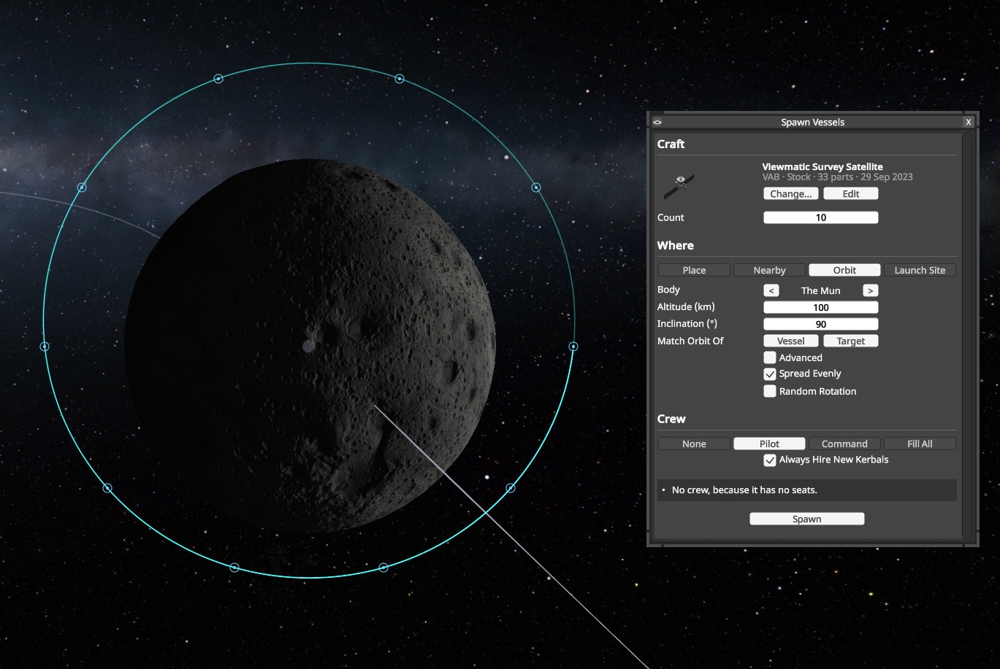
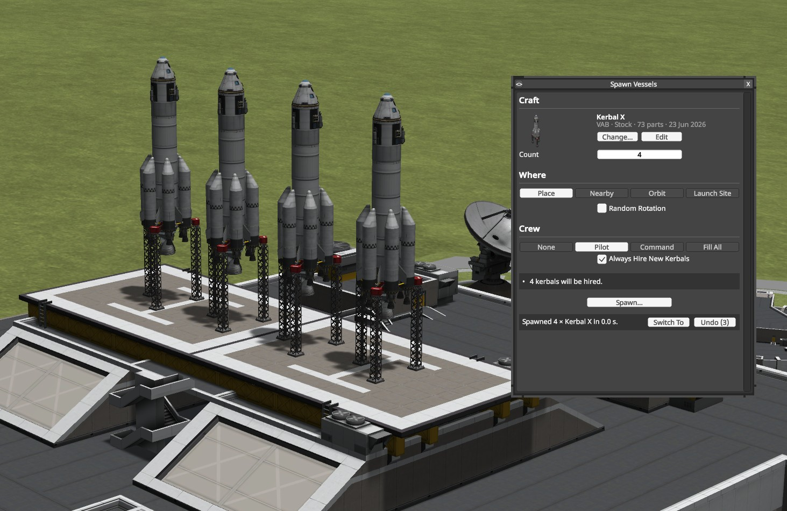
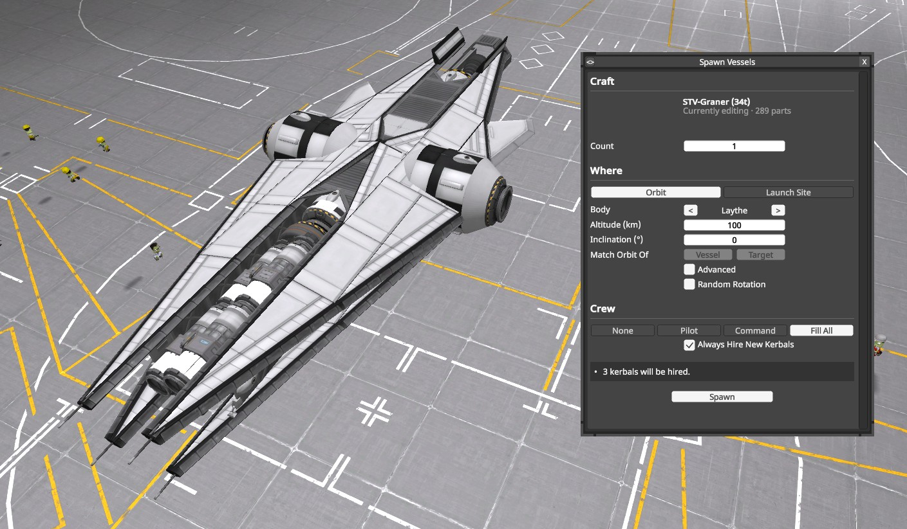
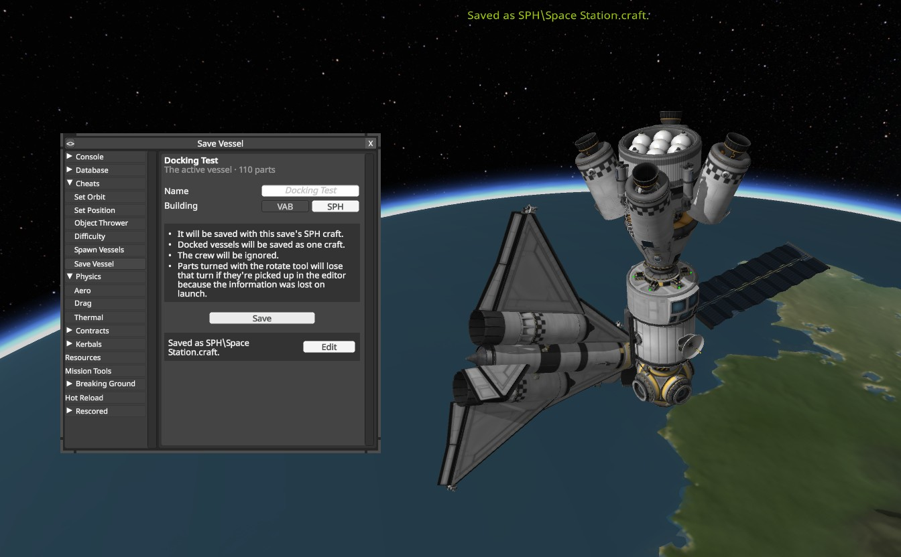
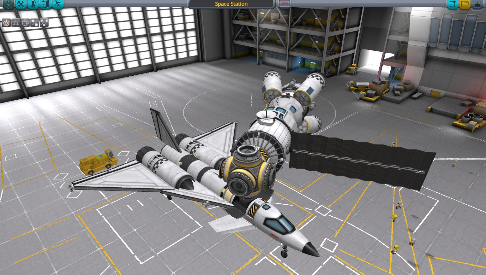

KSP mod for spawning vessels individually and en masse in a variety of ways from flight, the tracking station, the KSC or the SPH/VAB.

Press Alt+F, or open the debug console (Alt+F12) and go to Cheats > Spawn Vessels.

- Spawn craft from your game or provide a path to spawn any .craft file. Paths are picked up automatically from the clipboard.
- Clone the active vessel, or the selected one in the Tracking Station.
- Spawn the craft that you're editing in the VAB or SPH anywhere without leaving.
- Place vessels with the mouse: on the ground, next to your vessel, on any planet, or in any orbit from map view.
- Spawn them randomly nearby, in an orbit you type in, or at a launch site.
- Spawn as many as you like at once.
- Select how they should be crewed, hiring kerbals if needed.
- You can always undo the previous spawn.
- Save the current vessel as a craft file via Cheats > Save Vessel.

<details>
<summary>Screenshots</summary>

<p> </p>
<p> </p>
<p> </p>
<p> </p>

</details>

### For modders

`LazySpawner.dll` can spawn vessels for your mod.

The spawning process itself happens in a fraction of a second and is significantly faster than previous methods. Lazy Spawner translates the craft file straight into a vessel as your save stores it, writes that into the game, and KSP loads it like any other vessel when it comes into range. A craft file is only read once, so subsequent spawns of the same file are even faster.

Craft should spawn exactly as they would if spawned by the stock game, including robotics, staging, action groups, kerbals and the control point.

To use the Lazy Spawner API, reference LazySpawner.dll, add `[assembly: KSPAssemblyDependency("LazySpawner", 1, 1)]`, and list LazySpawner as a dependency.

```csharp
VesselTemplate template = VesselTemplate.FromCraft(path); // Or FromVessel(vessel). You make this once and can use it to spawn the same vessel many times.

// The vessel as the save has it. rover.vesselRef is the vessel itself, except in the editor, where there isn't one yet.
ProtoVessel rover = Spawner.Spawn(template, SpawnSituation.Landed(body, latitude, longitude, heading), new CrewSettings(CrewMode.Pilot));
ProtoVessel probe = Spawner.Spawn(template, SpawnSituation.Orbiting(orbit));

StartCoroutine(Spawner.SpawnAll(template, situations, crew, spawned)); // Several at once, spread over several frames

Spawner.Remove(rover); // Undo.
```

`CraftSaver` can turn a loaded vessel back into a craft file, with some limitations.

```csharp
EditorFacility facility = CraftSaver.Facility(vessel); // The VAB or SPH it was launched from, or a guess from its vessel type.

// Into the game's craft for that building, with a thumbnail. Overwrites a craft of the same name. Returns the file's path.
string path = CraftSaver.Save(vessel, facility, CraftSaver.FreeName(vessel, facility)); // FreeName numbers the vessel's name if it's taken.

// Or just the craft, to save elsewhere or use directly.
ConfigNode craft = CraftSaver.ToCraft(vessel, facility);
```

- The vessel is oriented such that the control point faces up in the VAB or forwards in the SPH. 
- Connected docking ports are attached as they would be if placed in the editor. 
- Kerbals are ignored. 
- Flight doesn't keep rotate tool rotations, so a part rotated with that tool will snap back to its default orientation when picked up in the editor.

Please list Lazy Spawner as a dependency rather than bundling it. KSP only loads one copy of the DLL, so it may pick your version over another newer version. If you want to reference a specific version for some reason, then please let me know so I can make Lazy Spawner coordinate itself in the necessary way.
